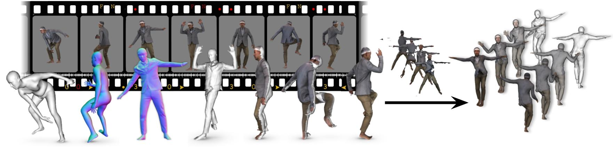
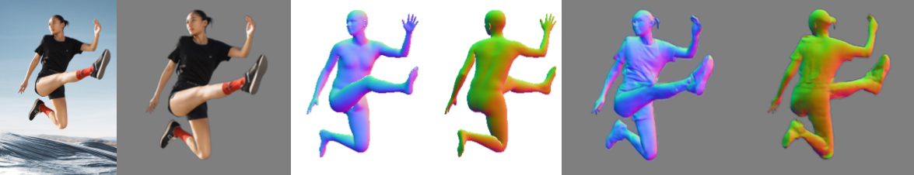
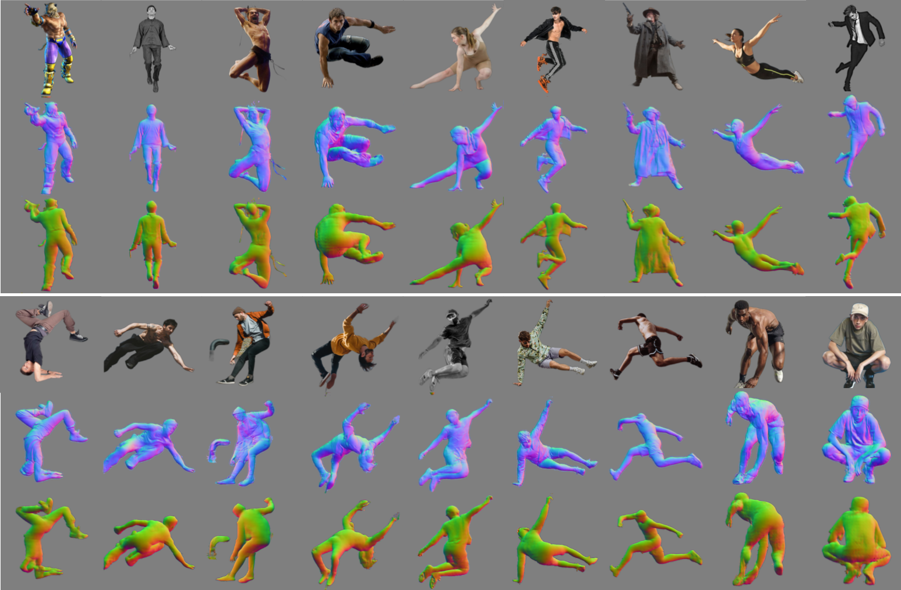

<!-- PROJECT LOGO -->

<p align="center">

  <h1 align="center">ICON: Implicit Clothed humans Obtained from Normals</h1>
  <p align="center">
    <a href="https://ps.is.tuebingen.mpg.de/person/yxiu"><strong>Yuliang Xiu</strong></a>
    ·
    <a href="https://ps.is.tuebingen.mpg.de/person/jyang"><strong>Jinlong Yang</strong></a>
    ·
    <a href="https://ps.is.mpg.de/~dtzionas"><strong>Dimitrios Tzionas</strong></a>
    ·
    <a href="https://ps.is.tuebingen.mpg.de/person/black"><strong>Michael J. Black</strong></a>
  </p>
  <h2 align="center">CVPR 2022</h2>
  <div align="center">
  </div>

  <a href="">
    
  </a>

  <p align="center">
  <br>
    <a href="https://pytorch.org/get-started/locally/"></a>
    <a href="https://pytorchlightning.ai/"></a>
    <a href="https://paperswithcode.com/sota/3d-human-reconstruction-on-cape?p=icon-implicit-clothed-humans-obtained-from"></a><br></br>
    <a href='https://arxiv.org/abs/2112.09127'>
      
    </a>
    <a href='https://icon.is.tue.mpg.de/' style='padding-left: 0.5rem;'>
      
    <a href="https://discord.gg/Vqa7KBGRyk"></a>
    <a href="https://youtu.be/ZufrPvooR2Q"></a>
  </p>
</p>

<br />
<br />

## News :triangular_flag_on_post:
- [2022/05/16] <a href="https://github.com/Arthur151/ROMP">BEV</a> is supported as optional HPS by <a href="https://scholar.google.com/citations?hl=en&user=fkGxgrsAAAAJ">Yu Sun</a>, see [commit #060e265](https://github.com/YuliangXiu/ICON/commit/060e265bd253c6a34e65c9d0a5288c6d7ffaf68e).
- [2022/05/15] Training code is released, please check [Training Instruction](docs/training.md).
- [2022/04/26] <a href="https://github.com/Jeff-sjtu/HybrIK">HybrIK (SMPL)</a> is supported as optional HPS by <a href="https://jeffli.site/">Jiefeng Li</a>, see [commit #3663704](https://github.com/YuliangXiu/ICON/commit/36637046dcbb5667cdfbee3b9c91b934d4c5dd05).
- [2022/03/05] <a href="https://github.com/YadiraF/PIXIE">PIXIE (SMPL-X)</a>, <a href="https://github.com/mkocabas/PARE">PARE (SMPL)</a>, <a href="https://github.com/HongwenZhang/PyMAF">PyMAF (SMPL)</a> are all supported as optional HPS.
- [2022/02/07] <a href='https://colab.research.google.com/drive/1-AWeWhPvCTBX0KfMtgtMk10uPU05ihoA?usp=sharing' style='padding-left: 0.5rem;'></a> is ready to use.

<br>

<!-- TABLE OF CONTENTS -->
<details open="open" style='padding: 10px; border-radius:5px 30px 30px 5px; border-style: solid; border-width: 1px;'>
  <summary>Table of Contents</summary>
  <ol>
    <li>
      <a href="#who-needs-ICON">Who needs ICON</a>
    </li>
    <li>
      <a href="#todo">TODO</a>
    </li>
    <li>
      <a href="#installation">Installation</a>
    </li>
    <li>
    <a href="#dataset">Dataset</a>
    </li>
    <li>
    <a href="#training">Training</a>
    </li>
    <li>
      <a href="#demo">Demo</a>
    </li>
    <li>
      <a href="#citation">Citation</a>
    </li>
    <li>
      <a href="#acknowledgments">Acknowledgments</a>
    </li>
    <li>
      <a href="#license">License</a>
    </li>
    <li>
      <a href="#disclosure">Disclosure</a>
    </li>
    <li>
      <a href="#contact">Contact</a>
    </li>
  </ol>
</details>
<br />
<br />


## Who needs ICON?
- Given an RGB image, you could get:
  - image (png): segmentation, normal images (body + cloth), overlap result (rgb + normal)
  - mesh (obj): SMPL-(X) body, reconstructed clothed human
  - video (mp4): self-rotated clothed human

||
|:--:|
|*ICON's intermediate results*|
||
|*ICON's SMPL Pose Refinement*|
||
|*ICON's normal prediction + reconstructed mesh (w/o & w/ smooth)*|

- If you want to create a **realistic and animatable 3D clothed avatar** direclty from video / sequential images
  - fully-textured with per-vertex color
  - can be animated by SMPL pose parameters
  - natural pose-dependent clothing deformation

||
|:--:|
|*3D Clothed Avatar, created from 400+ images using **ICON+SCANimate**, animated by AIST++*|


## TODO

- [x] testing code and pretrained models (*self-implemented version)
  - [x] ICON (w/ & w/o global encoder, w/ PyMAF/HybrIK/BEV/PIXIE/PARE as HPS)
  - [x] PIFu* (RGB image + predicted normal map as input)
  - [x] PaMIR* (RGB image + predicted normal map as input, w/ PyMAF/HybrIK/BEV/PIXIE/PARE as HPS)
- [x] colab notebook <a href='https://colab.research.google.com/drive/1-AWeWhPvCTBX0KfMtgtMk10uPU05ihoA?usp=sharing' style='padding-left: 0.5rem;'>
      
    </a>
- [x] dataset processing
  - [x] RGB/Normal Rendering
  - [x] Visibility computing
- [ ] training codes
  - [x] ICON (w/ & w/o global encoder, w/ SMPL-X)
  - [x] PIFu* (RGB image + predicted normal map as input)
  - [ ] PaMIR* (RGB image + predicted normal map as input, w/ voxelized SMPL)
- [ ] evaluation on CAPE (Hard, Easy)


## Installation

Please follow the [Installation Instruction](docs/installation.md) to setup all the required packages, extra data, and models.

## Dataset

Please follow the [Dataset Instruction](docs/dataset.md) to generate the train/val/test dataset from raw scans (THuman2.0).

## Training
Please follow the [Training Instruction](docs/training.md) to train your own model using THuman2.0.

## Demo

```bash
cd ICON

# PIFu* (*: re-implementation)
python -m apps.infer -cfg ./configs/pifu.yaml -gpu 0 -in_dir ./examples -out_dir ./results

# PaMIR* (*: re-implementation)
python -m apps.infer -cfg ./configs/pamir.yaml -gpu 0 -in_dir ./examples -out_dir ./results

# ICON w/ global filter (better visual details --> lower Normal Error))
python -m apps.infer -cfg ./configs/icon-filter.yaml -gpu 0 -in_dir ./examples -out_dir ./results -hps_type {pixie/pymaf/pare/hybrik/bev}

# ICON w/o global filter (higher evaluation scores --> lower P2S/Chamfer Error))
python -m apps.infer -cfg ./configs/icon-nofilter.yaml -gpu 0 -in_dir ./examples -out_dir ./results -hps_type {pixie/pymaf/pare/hybrik/bev}
```

## More Qualitative Results

||
|:--:| 
| *Comparison with other state-of-the-art methods* |
||
| *Predicted normals on in-the-wild images with extreme poses* |


<br/>
<br/>


## Citation

```bibtex
@inproceedings{xiu2022icon,
  title={{ICON}: {I}mplicit {C}lothed humans {O}btained from {N}ormals},
  author={Xiu, Yuliang and Yang, Jinlong and Tzionas, Dimitrios and Black, Michael J.},
  booktitle={IEEE/CVF Conf.~on Computer Vision and Pattern Recognition (CVPR)},
  month = jun,
  year={2022}
}
```

## Acknowledgments

We thank [Yao Feng](https://ps.is.mpg.de/person/yfeng), [Soubhik Sanyal](https://ps.is.mpg.de/person/ssanyal), [Qianli Ma](https://ps.is.mpg.de/person/qma), [Xu Chen](https://ait.ethz.ch/people/xu/), [Hongwei Yi](https://ps.is.mpg.de/person/hyi), [Chun-Hao Paul Huang](https://ps.is.mpg.de/person/chuang2), and [Weiyang Liu](https://wyliu.com/) for their feedback and discussions, [Tsvetelina Alexiadis](https://ps.is.mpg.de/person/talexiadis) for her help with the AMT perceptual study, [Taylor McConnell](https://ps.is.mpg.de/person/tmcconnell) for her voice over, [Benjamin Pellkofer](https://is.mpg.de/person/bpellkofer) for webpage, and [Yuanlu Xu](https://web.cs.ucla.edu/~yuanluxu/)'s help in comparing with ARCH and ARCH++.

Special thanks to [Vassilis Choutas](https://ps.is.mpg.de/person/vchoutas) for sharing the code of [bvh-distance-queries](https://github.com/YuliangXiu/bvh-distance-queries)

Here are some great resources we benefit from:

- [MonoPortDataset](https://github.com/Project-Splinter/MonoPortDataset) for Data Processing
- [PaMIR](https://github.com/ZhengZerong/PaMIR), [PIFu](https://github.com/shunsukesaito/PIFu), [PIFuHD](https://github.com/facebookresearch/pifuhd), and [MonoPort](https://github.com/Project-Splinter/MonoPort) for Benchmark
- [SCANimate](https://github.com/shunsukesaito/SCANimate) and [AIST++](https://github.com/google/aistplusplus_api) for Animation
- [rembg](https://github.com/danielgatis/rembg) for Human Segmentation
- [smplx](https://github.com/vchoutas/smplx), [PARE](https://github.com/mkocabas/PARE), [PyMAF](https://github.com/HongwenZhang/PyMAF), [PIXIE](https://github.com/YadiraF/PIXIE), [BEV](https://github.com/Arthur151/ROMP), and [HybrIK](https://github.com/Jeff-sjtu/HybrIK) for Human Pose & Shape Estimation
- [CAPE](https://github.com/qianlim/CAPE) and [THuman](https://github.com/ZhengZerong/DeepHuman/tree/master/THUmanDataset) for Dataset
- [PyTorch3D](https://github.com/facebookresearch/pytorch3d) for Differential Rendering


Some images used in the qualitative examples come from [pinterest.com](https://www.pinterest.com/).

This project has received funding from the European Union’s Horizon 2020 research and innovation programme under the Marie Skłodowska-Curie grant agreement No.860768 ([CLIPE Project](https://www.clipe-itn.eu)). 


## License
This code and model are available for non-commercial scientific research purposes as defined in the [LICENSE](LICENSE) file. By downloading and using the code and model you agree to the terms in the [LICENSE](LICENSE).

## Disclosure
MJB has received research gift funds from Adobe, Intel, Nvidia, Meta/Facebook, and Amazon.  MJB has financial interests in Amazon, Datagen Technologies, and Meshcapade GmbH.  While MJB was a part-time employee of Amazon during this project, his research was performed solely at, and funded solely by, the Max Planck Society.

## Contact

For more questions, please contact icon@tue.mpg.de

For commercial licensing, please contact ps-licensing@tue.mpg.de
