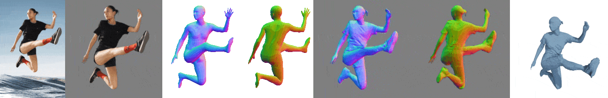
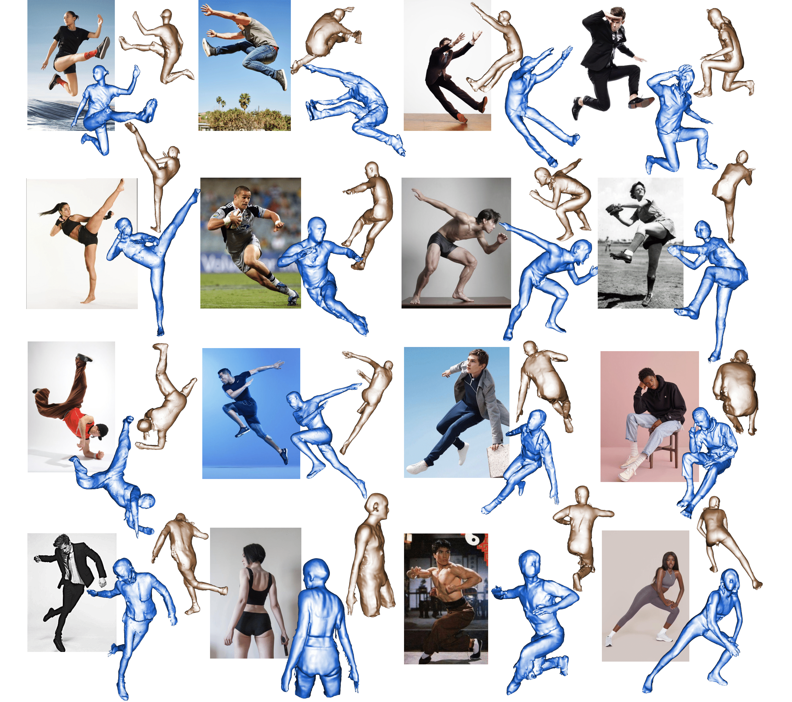

<!-- PROJECT LOGO -->
<br />
<p align="center">

  <h1 align="center">ICON: Implicit Clothed humans Obtained from Normals</h1>

  <a href="">
    
  </a>

  <p align="center">
    arXiv, December 2021.
    <br />
    <a href="https://ps.is.tuebingen.mpg.de/person/yxiu"><strong>Yuliang Xiu</strong></a>
    ·
    <a href="https://ps.is.tuebingen.mpg.de/person/jyang"><strong>Jinlong Yang</strong></a>
    ·
    <a href="https://ps.is.mpg.de/~dtzionas"><strong>Dimitrios Tzionas</strong></a>
    ·
    <a href="https://ps.is.tuebingen.mpg.de/person/black"><strong>Michael J. Black</strong></a>
  </p>

  <p align="center">
    <a href="https://pytorch.org/get-started/locally/"></a>
    <a href="https://pytorchlightning.ai/"></a><br><br>
    <a href='https://arxiv.org/abs/2112.09127'>
      
    </a>
    <a href='https://icon.is.tue.mpg.de/' style='padding-left: 0.5rem;'>
      
    <a href='https://youtu.be/ZufrPvooR2Q' style='padding-left: 0.5rem;'>
      
    </a>
    <a href='https://colab.research.google.com/drive/1-AWeWhPvCTBX0KfMtgtMk10uPU05ihoA?usp=sharing' style='padding-left: 0.5rem;'>
      
    </a>
    <a href='https://discord.gg/Vqa7KBGRyk' style='padding-left: 0.5rem;'>
      
    </a>
  </p>
</p>

[ICON Demo](https://user-images.githubusercontent.com/7944350/146271038-4d571bd1-69c2-46ad-a796-112c480a4173.mp4)

<br />
<br />

<!-- TABLE OF CONTENTS -->
<details open="open" style='padding: 10px; border-radius:5px 30px 30px 5px; border-style: solid; border-width: 1px;'>
  <summary>Table of Contents</summary>
  <ol>
    <li>
      <a href="#who-needs-ICON">Who needs ICON</a>
    </li>
    <li>
      <a href="#todo">TODO</a>
    </li>
    <li>
      <a href="#installation">Installation</a>
    </li>
    <li>
      <a href="#demo">Demo</a>
    </li>
    <li>
      <a href="#citation">Citation</a>
    </li>
    <li>
      <a href="#acknowledgments">Acknowledgments</a>
    </li>
    <li>
      <a href="#disclosure">Disclosure</a>
    </li>
    <li>
      <a href="#license">License</a>
    </li>
    <li>
      <a href="#contact">Contact</a>
    </li>
  </ol>
</details>
<br />
<br />


## Who needs ICON?
- If you want to reconstruct 3D clothed humans in **unconstrained poses** from in-the-wild images
  - together with the body under clothing (e.g. SMPL, SMPL-X)
  - clothed-body normal maps (front/back) predicted from images

||
|:--:|
|*ICON's outputs from single RGB image*|

- If you want to obtain a **realistic and animatable 3D clothed avatar** direclty from video / a sequence of monocular images
  - fully-textured with per-vertex color
  - could be animated by SMPL pose parameters
  - with pose-dependent clothing deformation


||
|:--:|
|*3D Clothed Avatar, created from 400+ images using **ICON+SCANimate**, animated by AIST++*|


<br/>
<br/>

## TODO

- [x] Testing code and pretrained model(*self-implemented version)
  - [x] ICON (w/ & w/o global encoder)
  - [x] PIFu* (RGB image + predicted normal map as input)
  - [x] PaMIR* (RGB image + predicted normal map as input)
- [x] Colab Notebook <a href='https://colab.research.google.com/drive/1-AWeWhPvCTBX0KfMtgtMk10uPU05ihoA?usp=sharing' style='padding-left: 0.5rem;'>
      
    </a>
- [ ] Training code
- [ ] Dataset processing code


## Installation

Please follow the [Installation Instruction](docs/Installation.md) to setup all the required packages, extra data, and models.

## Demo

```bash
cd ICON/apps

# PIFu* (*: re-implementation)
python infer.py -cfg ../configs/pifu.yaml -gpu 0 -in_dir ../examples -out_dir ../results

# PaMIR* (*: re-implementation)
python infer.py -cfg ../configs/pamir.yaml -gpu 0 -in_dir ../examples -out_dir ../results

# ICON w/ global filter (better visual details --> lower Normal Error))
python infer.py -cfg ../configs/icon-filter.yaml -gpu 0 -in_dir ../examples -out_dir ../results

# ICON w/o global filter (higher evaluation scores --> lower P2S/Chamfer Error))
python infer.py -cfg ../configs/icon-nofilter.yaml -gpu 0 -in_dir ../examples -out_dir ../results
```

## More Qualitative Results

||
|:--:| 
| *Comparison with other state-of-the-art methods* |
||
| *Reconstruction on in-the-wild photos with extreme poses (GIF)* |
||
| *Reconstruction on in-the-wild photos with extreme poses (PNG)* |
||
| *Predicted normals on in-the-wild images with extreme poses* |


<br/>
<br/>


## Citation

```bibtex
@article{xiu2021icon,
  title={ICON: Implicit Clothed humans Obtained from Normals},
  author={Xiu, Yuliang and Yang, Jinlong and Tzionas, Dimitrios and Black, Michael J},
  journal={arXiv preprint arXiv:2112.09127},
  year={2021}
}
```

## Acknowledgments

We thank [Yao Feng](https://ps.is.mpg.de/person/yfeng), [Soubhik Sanyal](https://ps.is.mpg.de/person/ssanyal), [Qianli Ma](https://ps.is.mpg.de/person/qma), [Xu Chen](https://ait.ethz.ch/people/xu/), [Hongwei Yi](https://ps.is.mpg.de/person/hyi), [Chun-Hao Paul Huang](https://ps.is.mpg.de/person/chuang2), and [Weiyang Liu](https://wyliu.com/) for their feedback and discussions, [Tsvetelina Alexiadis](https://ps.is.mpg.de/person/talexiadis) for her help with the AMT perceptual study, [Taylor McConnell](https://ps.is.mpg.de/person/tmcconnell) for her voice over, [Benjamin Pellkofer](https://is.mpg.de/person/bpellkofer) for webpage, and [Yuanlu Xu](https://web.cs.ucla.edu/~yuanluxu/)'s help in comparing with ARCH and ARCH++.

Special thanks to [Vassilis Choutas](https://ps.is.mpg.de/person/vchoutas) for sharing the code of [bvh-distance-queries](./lib/bvh-distance-queries/README.md)

Here are some great resources we benefit from:

- [MonoPortDataset](https://github.com/Project-Splinter/MonoPortDataset) for Data Processing
- [PaMIR](https://github.com/ZhengZerong/PaMIR), [PIFu](https://github.com/shunsukesaito/PIFu), [PIFuHD](https://github.com/facebookresearch/pifuhd), and [MonoPort](https://github.com/Project-Splinter/MonoPort) for Benchmark
- [SCANimate](https://github.com/shunsukesaito/SCANimate) and [AIST++](https://github.com/google/aistplusplus_api) for Animation
- [rembg](https://github.com/danielgatis/rembg) for Human Segmentation
- [smplx](https://github.com/vchoutas/smplx), [PARE](https://github.com/mkocabas/PARE), [PyMAF](https://github.com/HongwenZhang/PyMAF), and [PIXIE](https://github.com/YadiraF/PIXIE) for Human Pose & Shape Estimation
- [CAPE](https://github.com/qianlim/CAPE) and [THuman](https://github.com/ZhengZerong/DeepHuman/tree/master/THUmanDataset) for Dataset
- [PyTorch3D](https://github.com/facebookresearch/pytorch3d) for Differential Rendering


Some images used in the qualitative examples come from [pinterest.com](https://www.pinterest.com/).

This project has received funding from the European Union’s Horizon 2020 research and innovation programme under the Marie Skłodowska-Curie grant agreement No.860768 ([CLIPE Project](https://www.clipe-itn.eu)). 


## Disclosure

MJB has received research gift funds from Adobe, Intel, Nvidia, Facebook, and Amazon. While MJB is a part-time employee of Amazon, his research was performed solely at, and funded solely by, Max Planck. MJB has financial interests in Amazon, Datagen Technologies, and Meshcapade GmbH.

## License
This code and model are available for non-commercial scientific research purposes as defined in the [LICENSE](LICENSE) file. By downloading and using the code and model you agree to the terms in the [LICENSE](LICENSE).

## Contact

For more questions, please contact icon@tue.mpg.de

For commercial licensing, please contact ps-licensing@tue.mpg.de
