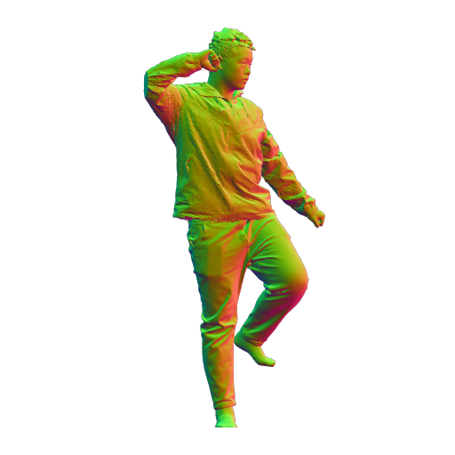
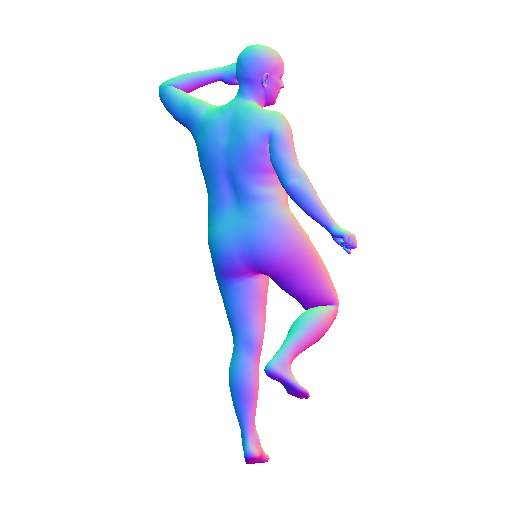
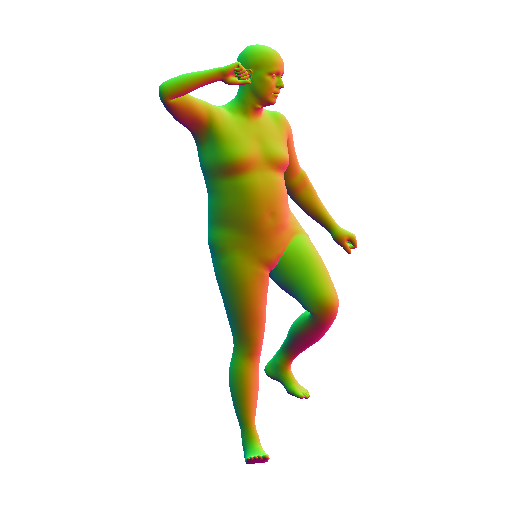
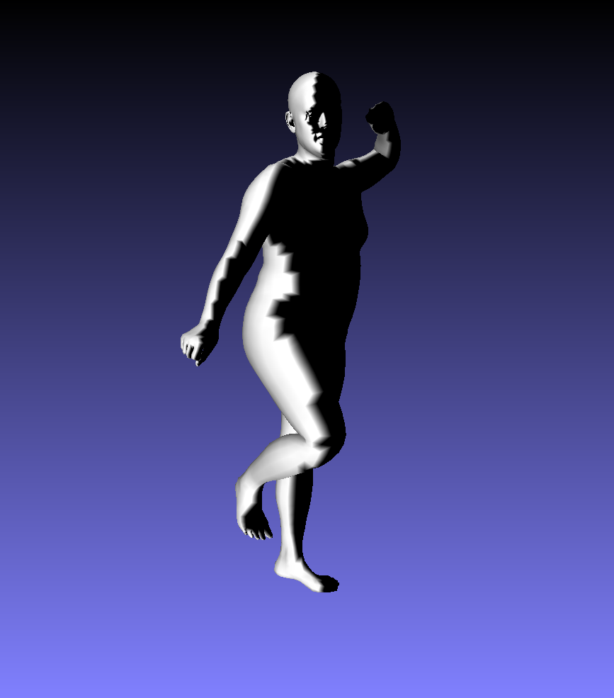

## Environment 

  * freeglut (`sudo apt-get install freeglut3-dev`)
  * (optional) EGL used for headless rendering (`apt install libgl1-mesa-dri libegl1-mesa libgbm1`)

## THuman2.0

Please refer to [THuman2.0-Dataset](https://github.com/ytrock/THuman2.0-Dataset) to download the original scans into `data/thuman2/scans`, and its SMPL-X fits into `data/thuman2/fits`. Then generate `all.txt` by `ls > ../all.txt` under `data/thuman2/scans`, which contains all the subject names (0000~0525).

:eyes: `./sample_data` contains one example of THuman2.0

## Debug Mode

:warning: For headless rendering (without window, such as clusters), please `export PYOPENGL_PLATFORM=egl` before running these scripts, also change `egl=True` in `scripts/render_single.py`.

Then you will get the rendered samples & visibility results under `debug/`

## Generate Mode 

**1. Rendering phrase**: RGB images, normal images, calibration array

```bash
conda activate icon
cd ICON/scripts
bash render_batch.sh gen all
```
You could check the rendering status from `log/render/thuman2-{num_views}-{size}-{part}.txt`

**2. Visibility phrase**: SMPL-X based visibility computation

```bash
bash vis_batch.sh gen all
```
You could check the visibility computing status from `log/vis/thuman2-{num_views}-{part}.txt`


:white_check_mark: NOW, you have all the synthetic dataset under `data/thuman2_{num_views}views`, which will be used for training. 

:arrow_right: NEXT, please jump to [training.md](training.md) for more details.

## Examples

|||||||
|---|---|---|---|---|---|
|RGB Image|Normal(Front)|Normal(Back)|Normal(SMPL, Front)|Normal(SMPL, Back)|Visibility|

