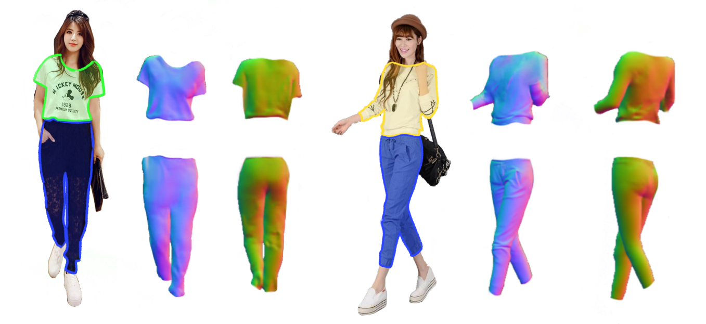

## Garment Extraction from Fashion Images (course project from 3DV of ETH Zürich)



Please check our [Report](https://icon.is.tue.mpg.de/media/upload/3dgarment.pdf) for more details.

Given `segmentation json` along with its corresponding `image`, it is possible to extract only garment geometries from the ICON's full reconstruction. 

Format of `segmentation json`:

```json
  {
  "item1": {
    "segmentation": [
      [
        x1,y1,x2,y2,.......
      ],
      [
        .....
      ]
    ],
    "category_id": 0,
    "category_name": "{clothing description}"
  },
  "item2": {
    "segmentation": [
      [
        x1,y1,x2,y2,.......
      ],
      [
        .....
      ]
    ],
    "category_id": 0,
    "category_name": "{clothing description}"
  }
}
```

Where "x1, y1, ..." are the coordinates of the segmentation boundaries. "category_id" identifies the type of clothing (refer to [DeepFashion2](https://github.com/switchablenorms/DeepFashion2#data-organization)). The segmentation and image files must have the same name. Please check a few samples under the `examples/segmentation`. 

To run ICON with segmentation you need to add `-seg_dir {path_to_segmentation_folder}`, all the output results are loccated under `{out_dir}/{method}/clothes`.

```bash
# Inference with segmentation
python -m apps.infer -cfg ./configs/icon-filter.yaml -gpu 0 -in_dir ./examples/segmentation -out_dir ./results -seg_dir ./examples/segmentation

# output under results/icon-filter/clothes
```

<div align="center">
    
  </div>

## Citation

```bibtex
@techreport{Gudmundsson2022garment,
  title       = "3D Garments Crawler from large-scale fashion images",
  author      = "Gudmundsson, Daniel and Barrau-Joyeaux, Marion and Collette, Arthur and Kjaer, Amalie and Peng, Songyou and Xiu, Yuliang",
  institution = "ETH Zürich",
  year        = 2022,
  month       = jun
}
```


## Contact

For questions, please contact with [Daniel Gudmundsson](mailto:dgudmundssom@student.ethz.ch), [Marion Barrau-Joyeaux](mailto:mbarrau@student.ethz.ch), [Arthur Collette](mailto:acollette@student.ethz.ch), and [Amalie Kjaer](mailto:akjaer@student.ethz.ch).