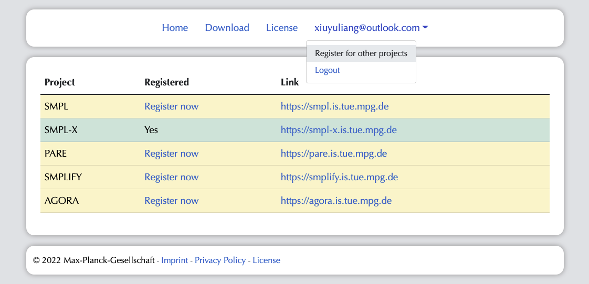

## Getting started

Start by cloning the repo:

```bash
git clone git@github.com:YuliangXiu/ICON.git
cd ICON
```  

## Environment
  * Ubuntu 20 / 18
  * **CUDA=11.0, GPU Memory > 12GB** 
  * Python = 3.8
  * PyTorch = 1.8.2 LTS (official [Get Started](https://pytorch.org/get-started/locally/))
  * PyTorch3D (official [INSTALL.md](https://github.com/facebookresearch/pytorch3d/blob/main/INSTALL.md), recommend [install-from-local-clone](https://github.com/facebookresearch/pytorch3d/blob/main/INSTALL.md#2-install-from-a-local-clone))

```bash
# install conda, skip if already have
wget https://repo.anaconda.com/miniconda/Miniconda3-py38_4.10.3-Linux-x86_64.sh
chmod +x Miniconda3-py38_4.10.3-Linux-x86_64.sh
bash Miniconda3-py38_4.10.3-Linux-x86_64.sh -b -f -p /usr/local
rm Miniconda3-py38_4.10.3-Linux-x86_64.sh

conda config --env --set always_yes true
conda update -n base -c defaults conda -y

# Note: 
# For google colab, please refer to ICON/colab.sh
# create conda env and install required libs (~20min)

cd ICON
conda env create -f environment.yaml
conda init bash
source ~/.bashrc
source activate icon
pip install -r requirements.txt --use-deprecated=legacy-resolver
```


:warning: If you have trouble assessing Google Drive, you need VPN to use `rembg` for the first time.

## Register at [ICON's website](https://icon.is.tue.mpg.de/)


Required:
  * [SMPL](http://smpl.is.tue.mpg.de/):  SMPL Model (Male, Female)
  * [SMPLIFY](http://smplify.is.tue.mpg.de/): SMPL Model (Neutral)
  * [ICON](https://icon.is.tue.mpg.de/): pretrained models and extra data for ICON

Optional:
  * [SMPL-X](http://smpl-x.is.tue.mpg.de/): SMPL-X Model, used for training
  * [AGORA](https://agora.is.tue.mpg.de/): SMIL Kid Model, used for training
  * [PARE](https://pare.is.tue.mpg.de/): optional SMPL HPS estimator
  * [PIXIE](https://pixie.is.tue.mpg.de/): optional SMPL-X HPS estimator


:warning: Click **Register now** on all dependencies, then you can download them all with **ONE** account.

## Downloading required models and extra data
  ```bash
  cd ICON
  bash fetch_data.sh # requires username and password
  ```
  * Download [PyMAF](https://github.com/HongwenZhang/PyMAF#necessary-files), [PARE (optional, SMPL)](https://github.com/mkocabas/PARE#demo), [PIXIE (optional, SMPL-X)](https://pixie.is.tue.mpg.de/), [HybrIK (optional, SMPL)](https://github.com/Jeff-sjtu/HybrIK)
  
  ```bash
  bash fetch_hps.sh
  ```


## Tree structure of **data** folder

```
data/
├── ckpt/
│   ├── icon-filter.ckpt
│   ├── icon-nofilter.ckpt
│   ├── normal.ckpt
│   ├── pamir.ckpt
│   └── pifu.ckpt
├── hybrik_data/
│   ├── h36m_mean_beta.npy
│   ├── J_regressor_h36m.npy
│   ├── hybrik_config.yaml
│   └── pretrained_w_cam.pth
├── pare_data/
│   ├── J_regressor_{extra,h36m}.npy
│   ├── pare/
│   │   └── checkpoints/
│   │       ├── pare_checkpoint.ckpt
│   │       ├── pare_config.yaml
│   │       ├── pare_w_3dpw_checkpoint.ckpt
│   │       └── pare_w_3dpw_config.yaml
│   ├── smpl_mean_params.npz
│   └── smpl_partSegmentation_mapping.pkl
├── pixie_data/
│   ├── flame2smplx_tex_1024.npy
│   ├── MANO_SMPLX_vertex_ids.pkl
│   ├── pixie_model.tar
│   ├── SMPL-X__FLAME_vertex_ids.npy
│   ├── SMPL_X_template_FLAME_uv.obj
│   ├── smplx_extra_joints.yaml
│   ├── smplx_hand.obj
│   ├── SMPLX_NEUTRAL_2020.npz
│   ├── smplx_tex.obj
│   ├── smplx_tex.png
│   ├── SMPLX_to_J14.pkl
│   ├── uv_face_eye_mask.png
│   └── uv_face_mask.png
├── pymaf_data/
│   ├── cube_parts.npy
│   ├── gmm_08.pkl
│   ├── J_regressor_{extra,h36m}.npy
│   ├── mesh_downsampling.npz
│   ├── pretrained_model/
│   │   └── PyMAF_model_checkpoint.pt
│   ├── smpl_mean_params.npz
│   ├── UV_data/
│   │   ├── UV_Processed.mat
│   │   └── UV_symmetry_transforms.mat
│   └── vertex_texture.npy
├── smpl_related/
│   ├── models/
│   │   ├── smpl/
│   │   │   ├── SMPL_{FEMALE,MALE,NEUTRAL}.pkl
│   │   │   ├── smpl_kid_template.npy
│   │   └── smplx/
│   │       ├── SMPLX_{FEMALE,MALE,NEUTRAL}.npz
│   │       ├── SMPLX_{FEMALE,MALE,NEUTRAL}.pkl
│   │       ├── smplx_kid_template.npy
│   │       └── version.txt
│   └── smpl_data/
│       ├── smpl_verts.npy
│       ├── smplx_cmap.npy
│       ├── smplx_faces.npy
│       └── smplx_verts.npy
└── tedra_data/
    ├── faces.txt
    ├── tetrahedrons.txt
    ├── tetgen_{male,female,neutral}_{adult,kid}_structure.npy
    ├── tetgen_{male,female,neutral}_{adult,kid}_vertices.npy
    ├── tetra_{male,female,neutral}_{adult,kid}_smpl.npz
    ├── tetrahedrons_{male,female,neutral}_{adult,kid}.txt
    └── vertices.txt
```

