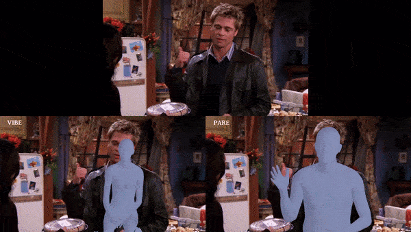
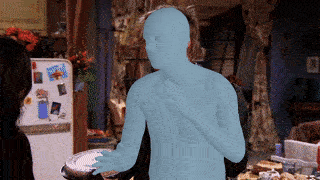

# PARE: Part Attention Regressor for 3D Human Body Estimation [ICCV 2021]

[]()
[](https://pare.is.tue.mpg.de/)
[](https://arxiv.org/abs/2104.08527)

> [**PARE: Part Attention Regressor for 3D Human Body Estimation**](https://arxiv.org/abs/2104.08527),            
> [Muhammed Kocabas](https://ps.is.tuebingen.mpg.de/person/mkocabas), 
> [Chun-Hao Paul Huang](https://ps.is.tuebingen.mpg.de/person/chuang2),
> [Otmar Hilliges](https://ait.ethz.ch/people/hilliges/)
[Michael J. Black](https://ps.is.tuebingen.mpg.de/person/black),        
> *International Conference on Computer Vision (ICCV), 2021*

<p float="left">
  
  

</p>

## Features

PARE is an occlusion-robust human pose and shape estimation method. This implementation includes the demo and evaluation code for 
PARE implemented in PyTorch.

## Updates

- 13/10/2021: Demo and evaluation code is released.

## Getting Started

PARE has been implemented and tested on Ubuntu 18.04 with 
python >= 3.7. If you don't have a suitable device, 
try running our Colab demo.

Clone the repo:

```shell
git clone https://github.com/mkocabas/PARE.git
```

Install the requirements using virtualenv or conda:

```shell
# pip
source scripts/install_pip.sh

# conda
source scripts/install_conda.sh
```

## Demo

First, you need to download the required data 
(i.e our trained model and SMPL model parameters). It is approximately 1.3GB. 
To do this you can just run:

```shell
source scripts/prepare_data.sh
```

### Video Demo
Run the command below. See `scripts/demo.py` for more options.
```shell script
python scripts/demo.py --vid_file data/sample_video.mp4 --output_folder logs/demo 
```

Sample demo output:

<p float="left">
  
</p>

### Image Folder Demo

```shell script
python scripts/demo.py --image_folder <path to image folder> --output_folder logs/demo
```

#### Output format

If demo finishes succesfully, it needs to create a file named `pare_output.pkl` in the `--output_folder`.
We can inspect what this file contains by:

```
>>> import joblib # you may also use native pickle here as well

>>> output = joblib.load('pare_output.pkl') 

>>> print(output.keys())  
                                                                                                                                                                                                                                                                                                                                                                                              
dict_keys([1, 2, 3, 4]) # these are the track ids for each subject appearing in the video

>>> for k,v in output[1].items(): print(k,v.shape) 

pred_cam (n_frames, 3)          # weak perspective camera parameters in cropped image space (s,tx,ty)
orig_cam (n_frames, 4)          # weak perspective camera parameters in original image space (sx,sy,tx,ty)
verts (n_frames, 6890, 3)       # SMPL mesh vertices
pose (n_frames, 72)             # SMPL pose parameters
betas (n_frames, 10)            # SMPL body shape parameters
joints3d (n_frames, 49, 3)      # SMPL 3D joints
joints2d (n_frames, 21, 3)      # 2D keypoint detections by STAF if pose tracking enabled otherwise None
bboxes (n_frames, 4)            # bbox detections (cx,cy,w,h)
frame_ids (n_frames,)           # frame ids in which subject with tracking id #1 appears
smpl_joints2d (n_frames, 49, 2) # SMPL 2D joints 
```
## Google Colab

## Training

Training instructions will follow soon.

## Evaluation
You need to download [3DPW](https://virtualhumans.mpi-inf.mpg.de/3DPW/) 
and [3DOH](https://www.yangangwang.com/papers/ZHANG-OOH-2020-03.html) 
datasets before running the evaluation script. 
After the download, the `data` folder should look like:

```shell
data/
├── body_models
│   └── smpl
├── dataset_extras
├── dataset_folders
│   ├── 3doh
│   └── 3dpw
└── pare
    └── checkpoints

```

Then, you can evaluate PARE by running:

```shell script
python scripts/eval.py \
  --cfg data/pare/checkpoints/pare_config.yaml \
  --opts DATASET.VAL_DS 3doh_3dpw-all
  
python scripts/eval.py \
  --cfg data/pare/checkpoints/pare_w_3dpw_config.yaml \
  --opts DATASET.VAL_DS 3doh_3dpw-all
```

You should obtain results in this table on 3DPW test set:

| | MPJPE | PAMPJPE | V2V|
|--- | --- | --- | ---|
|PARE | 82 | 50.9 | 97.9|
|PARE (w. 3DPW) | 74.5 | 46.5 | 88.6|

## Occlusion Sensitivity Analysis

We prepare a script to run occlusion sensitivity analysis
proposed in our paper. Occlusion sensitivity analysis slides
an occluding patch on the image and visualizes how human pose
and shape estimation result affected.

```shell
python scripts/occlusion_analysis.py \
  --cfg data/pare/checkpoints/pare_config.yaml \
  --ckpt data/pare/checkpoints/pare_checkpoint.ckpt
```

Sample occlusion test output:

<p float="left">
  
</p>

## Citation

```bibtex
@inproceedings{Kocabas_PARE_2021,
  title = {{PARE}: Part Attention Regressor for {3D} Human Body Estimation},
  author = {Kocabas, Muhammed and Huang, Chun-Hao P. and Hilliges, Otmar and Black, Michael J.},
  booktitle = {Proc. International Conference on Computer Vision (ICCV)},
  pages = {11127--11137},
  month = oct,
  year = {2021},
  doi = {},
  month_numeric = {10}
}
```
## License

This code is available for **non-commercial scientific research purposes** as defined in the [LICENSE file](LICENSE). By downloading and using this code you agree to the terms in the [LICENSE](LICENSE). Third-party datasets and software are subject to their respective licenses.

## References

We indicate if a function or script is borrowed externally inside each file. Consider citing these works if you use them in your project.

## Contact

For questions, please contact pare@tue.mpg.de

For commercial licensing (and all related questions for business applications), please contact ps-licensing@tue.mpg.de.


